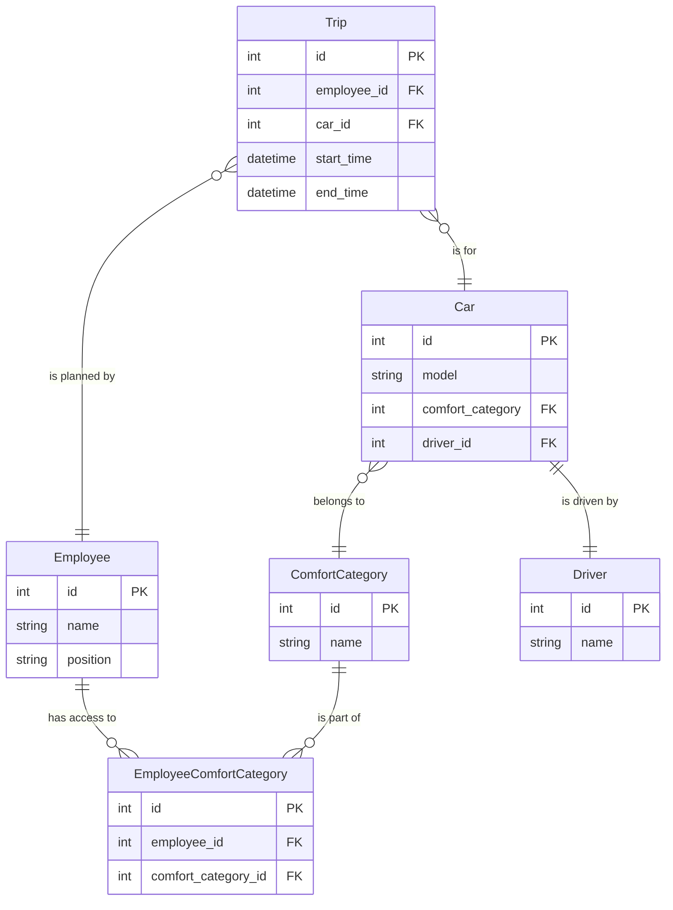

```mermaid
erDiagram
    Employee {
        int id PK
        string name
        string position
    }
    Car {
        int id PK
        string model
        int comfort_category FK
        int driver_id FK
    }
    ComfortCategory {
        int id PK
        string name
    }
    Driver {
        int id PK
        string name
    }
    Trip {
        int id PK
        int employee_id FK
        int car_id FK
        datetime start_time
        datetime end_time
    }
    EmployeeComfortCategory {
        int id PK
        int employee_id FK
        int comfort_category_id FK
    }

    Employee ||--o{ EmployeeComfortCategory : "has access to"
    ComfortCategory ||--o{ EmployeeComfortCategory : "is part of"
    Car }o--|| ComfortCategory : "belongs to"
    Car ||--|| Driver : "is driven by"
    Trip }o--|| Car : "is for"
    Trip }o--|| Employee : "is planned by"

```
